# Music Base

#### Autor: Wiktor Wojtanowski

## Opis

Music Base jest aplikacją internetową do wyświetlania danych muzycznych - piosenek, artystów i albumów. 

Aplikacja zawiera następujące funkcjonalności:
- wyszukiwanie i przeglądanie danych muzycznych,
- utworzenie konta i logowanie,
- polubienie wybranych piosenek,
- panel administratora - możliwość zarządzania (dodawania / usunięcia) danymi muzycznymi.

## Wymagania

* [Node.js i NPM](https://nodejs.org/en/download)
* [Docker](https://www.docker.com/)
* [Visual Studio Code](https://code.visualstudio.com/)
* [Google Chrome](https://www.google.com/intl/pl/chrome/) (dla testów)

## Przygotowanie aplikacji

1. Uruchom Docker i Visual Studio Code.

2. W Visual Studio Code zainstaluj rozszerzenie "Docker".

3. Otwórz folder projektu w VSCode i w nim otwórz "docker-compose.yaml".

4. Przeciągni kursor na zawartość kodu, kliknij prawym przyciskiem myszy i wybierz "Compose Up". Poczekaj, aż wszystkie kontenery będą skomponowane.

5. Przejdź do [tego linku](http://localhost:4200/). Strona powinna się wyświetlać w takiej postaci:

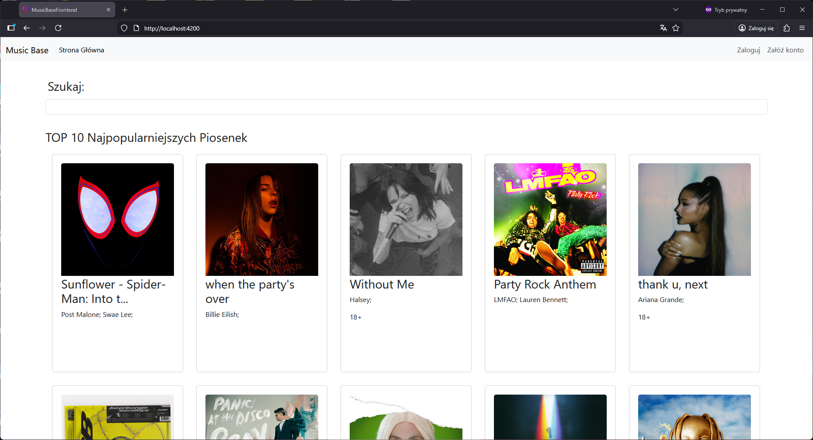


## Testy

Testy jednostkowe i integracyjne są samodzienie wykonywane na 11 komponentach w Angularze.

Aby uruchomić wszystkie testy jednostkowe i integracyjne w projekcie należy uruchomić terminal w projekcie i wykonać następujące komendy:

```sh
cd Frontend
npm install
npm run test
```

Powinien aytomatycznie wyskoczyć okno Chrome pokazujący wszystkie wykonane testy na wsystkich komponentach.

Testy manualne (Test Cases) znajdują się na tablicy [MusicBase_projekt](https://trello.com/b/cEUdgEzi/musicbaseprojekt) w Trello.


## Używanie aplikacji

### Przeglądanie bazy muzycznej

1. Klikając na dowolną kartę piosenki (np. when the party's over), można zobaczyć dane tej konkretnej piosenki.

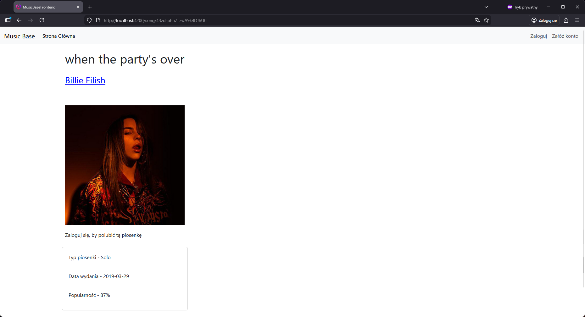

2. Można także kliknąć na nazwę twórcy (lub albumu) i zobaczyć ich dane. Na stronie konkretnej artysty można zobaczyć dominujący gatunek, najpopularniejsze utwory i wydane albumy.

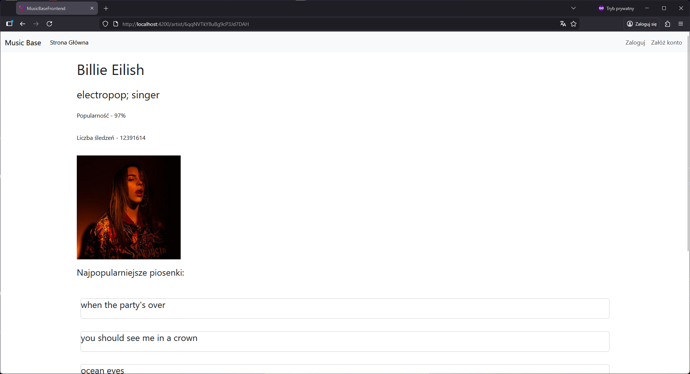

3. Na stronie głównej można także znaleźć 'search bar' wyszukującą dane muzyczne po podanej frazie. Wybierz, co chcesz szukać (piosenka, album, artysta) i po wpisaniu trzech pierwszych liter pojawiają się dane, którego nazwy są podobne do wpisanej frazy.

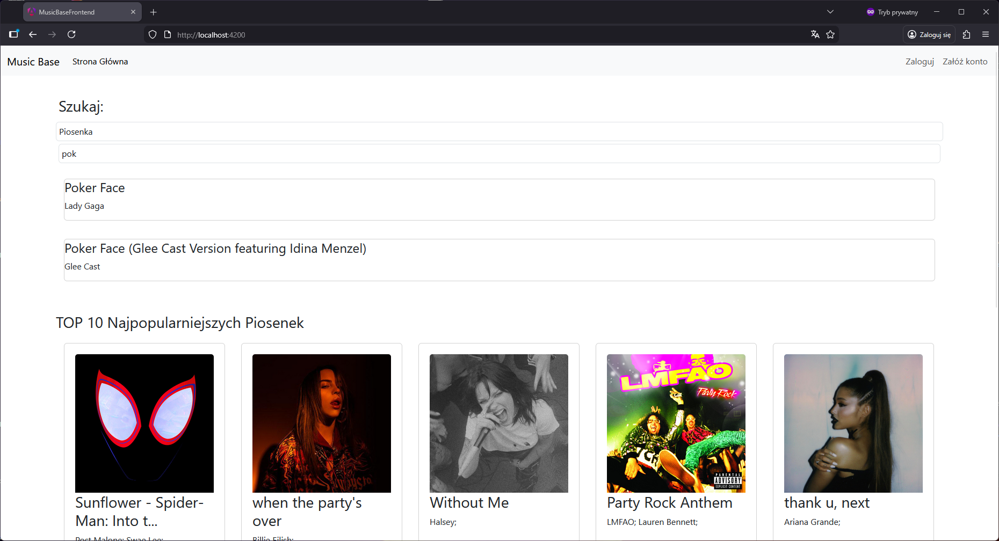

4. Klikając na dany wynik, wykonuje się przejście do danej strony.

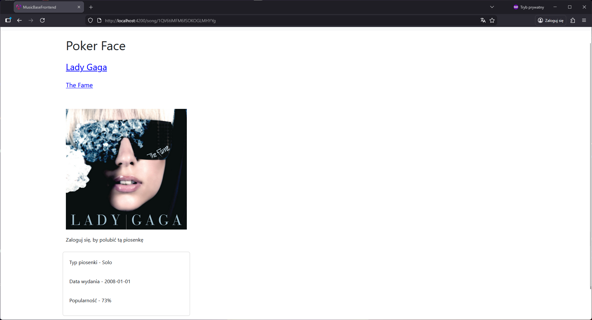


### Logowanie i tworzenie konta

1. W menu nawigacji (na samej górze) znajdują się przycisk logowania i tworzenia konta. Aby utworzyć konto należy kliknąć w zakładkę 'Stwórz konto'.

2. Na stronie zakładania konta należy wprowadzić adres e-mail, hasło i nazwę użytkownika. Po ich wprowadzaniu należy kliknąć w 'Sign Up', by utworzyć konto.

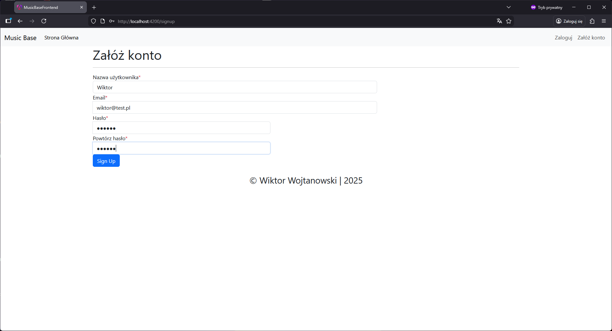

3. Następnie należy przejść do logowania. Klikając na 'Zaloguj' w menu nawigacji, otworzy się strona logowania. Tam należy wprowadzić e-mail i hasło do konta, później kliknąć przycisk 'Zaloguj'.


Przy prawidłowych danych aplikacja automatycznie przekieruje do menu startowego i w menu nawigacji pokazują się nowe przyciski: 
- 'Ulubione' - lista ulubionych piosenek,
- 'Wyloguj' - wylogowanie ze strony.


### Dodanie piosenki do ulubionych

1. Kliknij na wcześniejszą kartę piosenki. Teraz pojawia się przycisk 'Polub'.

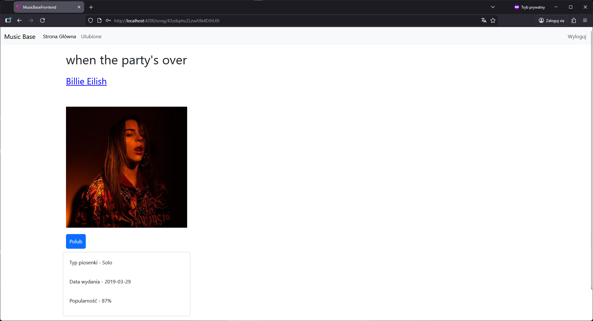

2. Kliknij przycisk 'Polub', a następnie przejdź do strony 'Favourites'. Tam będą zapisane piosenki, które były polubione.

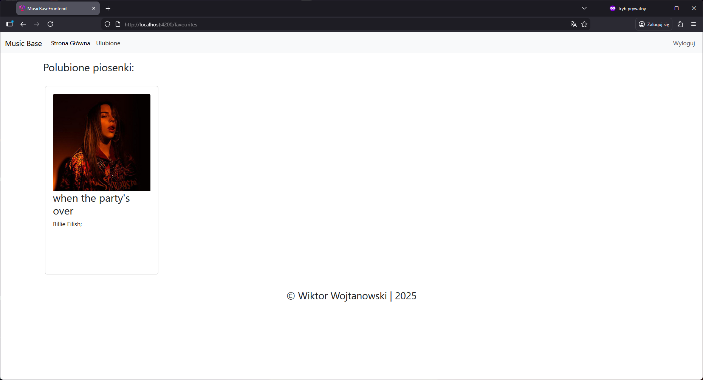


### Panel administratora


1. Aby się dostać do panelu administratora, należy zalogować się jako administrator. Jak jesteś zalogowany, to się wyloguj (kliknij w zakładkę 'Wyloguj'). Przejdź do zakładki 'Zaloguj', wpisz następujące dane i zaloguj się.
- Email: admin@test.pl
- Hasło: admin

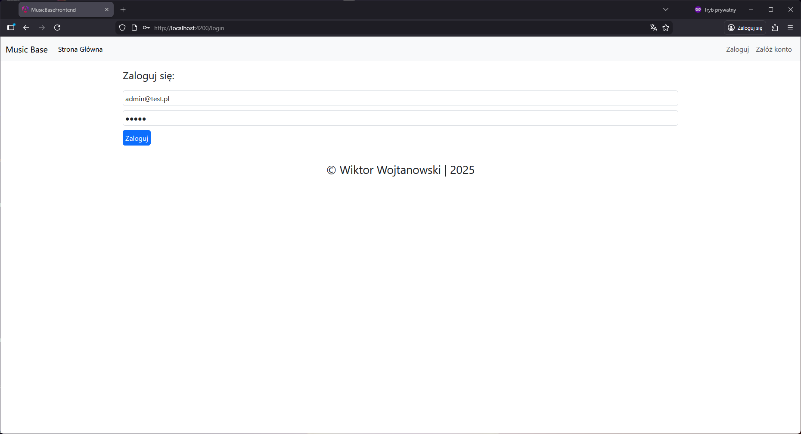

2. Pojawi się na górze strony zakładka 'Panel Administratora'. Przejdź do niego.

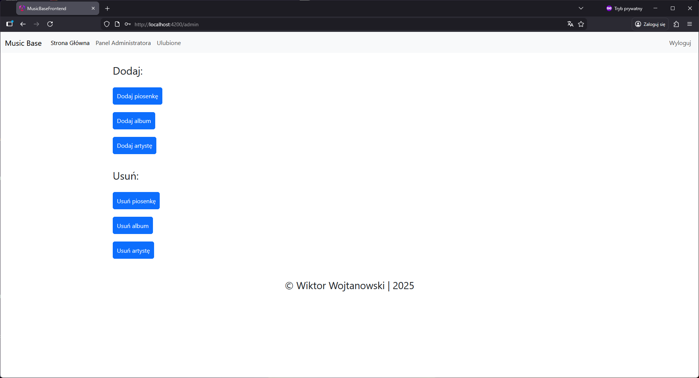

Z panelu można dodawać i usuwać dane muzyczne (piosenki, albumy i artyści). Teraz spróbujemy dodać do bazy danych nową artystę wraz z piosenką i albumem.

3. Kliknij w 'Dodaj artystę'. Pojawi się formularz do wypełnienia. Wypełnij ten formularz danymi tak jak na obrazie poniżej:

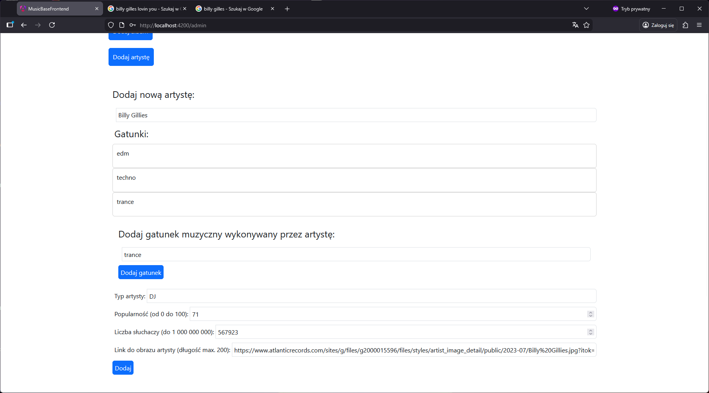

W razie wprowadzeniu złego gatunku odśwież stronę.

4. Kliknij przycisk 'Dodaj' - powinno przejść do strony nowo dodanej artysty. 

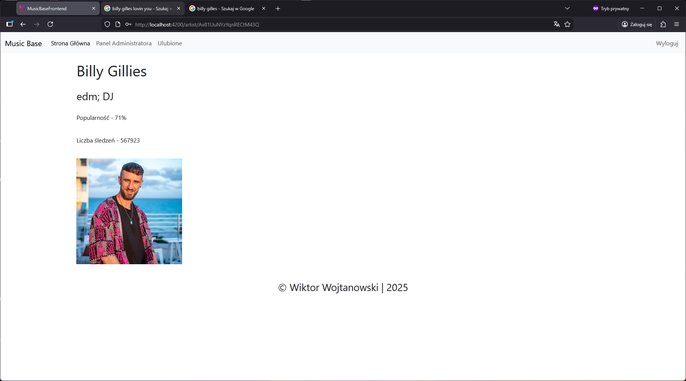

5. Przejdź do panelu administratora i kliknij 'Dodaj piosenkę'. Uzupełnij dane tak jak na obrazie poniżej:

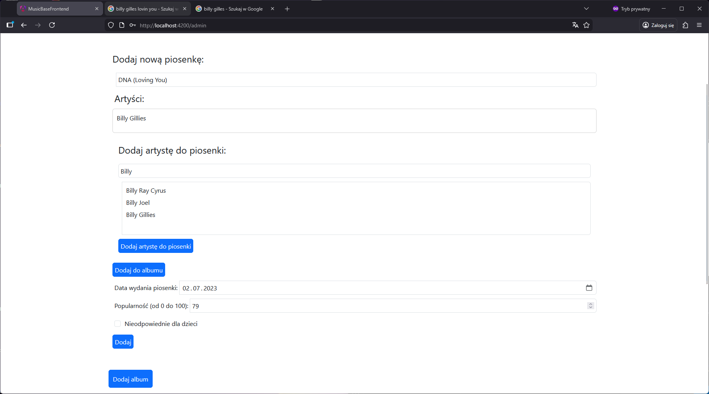

6. Kliknij przycisk 'Dodaj' - powinno przejść do strony nowo dodanej piosenki.

7. Przejdź znowu do panelu administratora i kliknij 'Dodaj album'. Uzupełnij dane tak jak na obrazach poniżej:

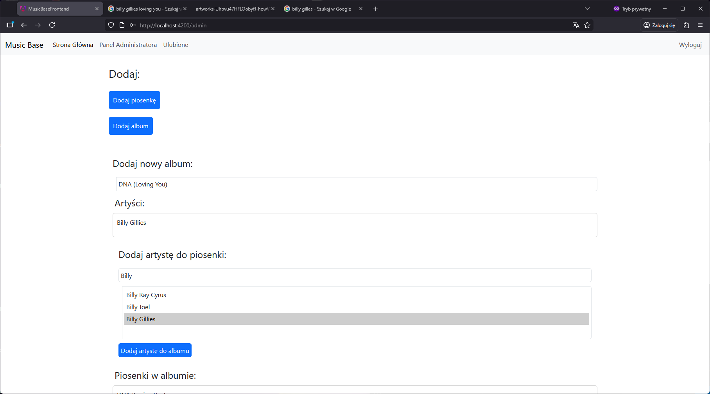


Nie zapomnij dodać wcześniej utworzonego artysty i piosenki.

8. Kliknij przycisk 'Dodaj' - powinno przejść do strony nowo dodanego albumu.

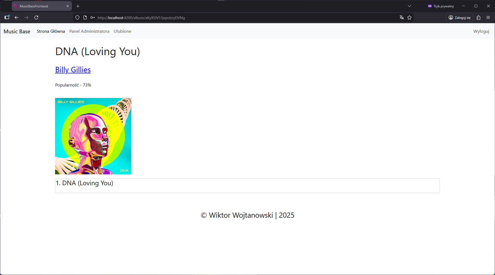

9. Klikając w utwór 'Nr. 1 DNA (Loving You)' zobaczymy ostateczną stronę nowo dodanej piosenki.

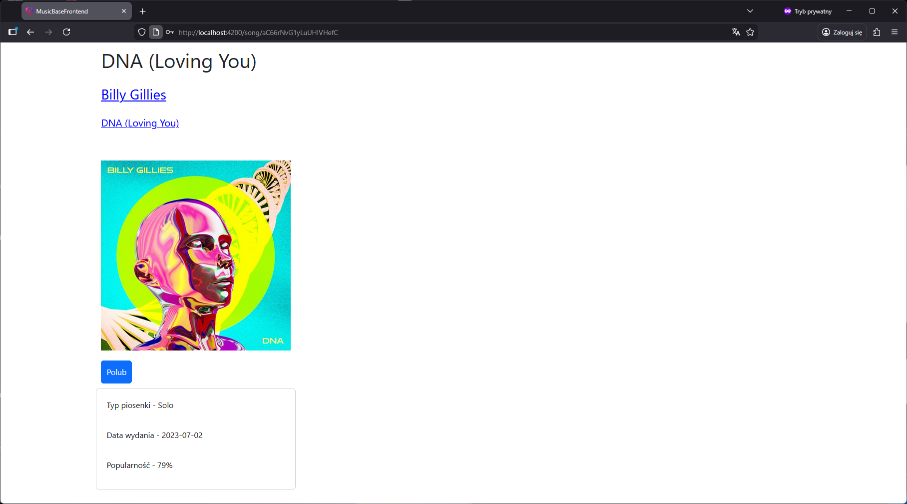